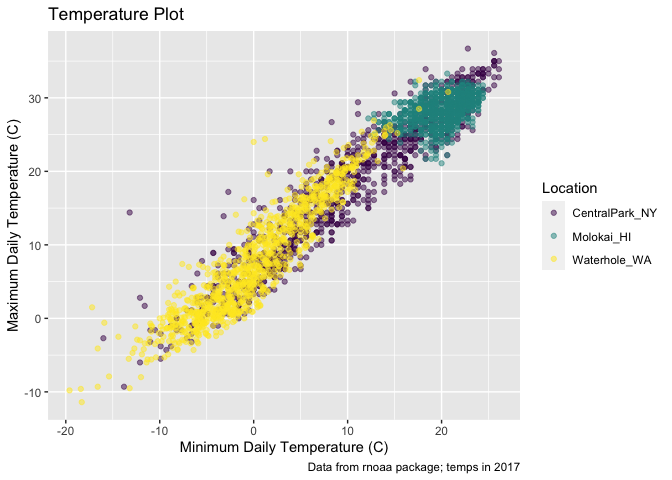
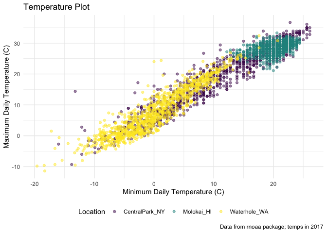

Visualization pt 2
================

``` r
library(tidyverse)
```

    ## ── Attaching core tidyverse packages ──────────────────────── tidyverse 2.0.0 ──
    ## ✔ dplyr     1.1.3     ✔ readr     2.1.4
    ## ✔ forcats   1.0.0     ✔ stringr   1.5.0
    ## ✔ ggplot2   3.4.3     ✔ tibble    3.2.1
    ## ✔ lubridate 1.9.2     ✔ tidyr     1.3.0
    ## ✔ purrr     1.0.2     
    ## ── Conflicts ────────────────────────────────────────── tidyverse_conflicts() ──
    ## ✖ dplyr::filter() masks stats::filter()
    ## ✖ dplyr::lag()    masks stats::lag()
    ## ℹ Use the conflicted package (<http://conflicted.r-lib.org/>) to force all conflicts to become errors

``` r
library(patchwork)
```

## Load the weather data

``` r
weather_df = 
  rnoaa::meteo_pull_monitors(
    c("USW00094728", "USW00022534", "USS0023B17S"),
    var = c("PRCP", "TMIN", "TMAX"), 
    date_min = "2021-01-01",
    date_max = "2023-12-31") |>
  mutate(
    name = recode(
      id, 
      USW00094728 = "CentralPark_NY", 
      USW00022534 = "Molokai_HI",
      USS0023B17S = "Waterhole_WA"),
    tmin = tmin / 10,
    tmax = tmax / 10) |>
  select(name, id, everything())
```

    ## using cached file: /Users/vickymello/Library/Caches/org.R-project.R/R/rnoaa/noaa_ghcnd/USW00094728.dly

    ## date created (size, mb): 2023-09-29 12:01:15.029303 (8.525)

    ## file min/max dates: 1869-01-01 / 2023-09-30

    ## using cached file: /Users/vickymello/Library/Caches/org.R-project.R/R/rnoaa/noaa_ghcnd/USW00022534.dly

    ## date created (size, mb): 2023-09-29 12:01:23.819854 (3.83)

    ## file min/max dates: 1949-10-01 / 2023-09-30

    ## using cached file: /Users/vickymello/Library/Caches/org.R-project.R/R/rnoaa/noaa_ghcnd/USS0023B17S.dly

    ## date created (size, mb): 2023-09-29 12:01:26.760715 (0.994)

    ## file min/max dates: 1999-09-01 / 2023-09-30

## Using labs() to label this plot

``` r
weather_df %>% 
  ggplot(aes(x = tmin, y = tmax, color = name)) +
  geom_point(alpha = .5) +
  labs(
    title = "Temperature Plot",
    x = "Minimum Daily Temperature (C)",
    y = "Maximum Daily Temperature (C)",
    caption = "Data from rnoaa package; temps in 2017"
  )
```

    ## Warning: Removed 30 rows containing missing values (`geom_point()`).

<!-- -->

## Scales

Start w the same plot

``` r
weather_df %>% 
  ggplot(aes(x = tmin, y = tmax, color = name)) +
  geom_point(alpha = .5) +
  labs(
    title = "Temperature Plot",
    x = "Minimum Daily Temperature (C)",
    y = "Maximum Daily Temperature (C)",
    caption = "Data from rnoaa package; temps in 2017"
  ) +
  scale_x_continuous(
    breaks = c(-15, 0, 15),
    labels = c("-15 C","0 C", "15 C")
  ) +
  scale_y_continuous(
    position = "right" 
  )
```

    ## Warning: Removed 30 rows containing missing values (`geom_point()`).

<!-- -->

## Look at color scales

``` r
weather_df %>% 
  ggplot(aes(x = tmin, y = tmax, color = name)) +
  geom_point(alpha = .5) +
  labs(
    title = "Temperature Plot",
    x = "Minimum Daily Temperature (C)",
    y = "Maximum Daily Temperature (C)",
    caption = "Data from rnoaa package; temps in 2017"
  ) +
 viridis::scale_color_viridis(
    name = "Location",
    discrete = TRUE)
```

    ## Warning: Removed 30 rows containing missing values (`geom_point()`).

<!-- -->

## Themes

Shift the legend:

``` r
weather_df %>% 
  ggplot(aes(x = tmin, y = tmax, color = name)) +
  geom_point(alpha = .5) +
  labs(
    title = "Temperature Plot",
    x = "Minimum Daily Temperature (C)",
    y = "Maximum Daily Temperature (C)",
    caption = "Data from rnoaa package; temps in 2017"
  ) +
 viridis::scale_color_viridis(
    name = "Location",
    discrete = TRUE) +
  theme(legend.position = "bottom")
```

    ## Warning: Removed 30 rows containing missing values (`geom_point()`).

<!-- -->

Change overall theme (theme minimal is jeffs fav)

``` r
weather_df %>% 
  ggplot(aes(x = tmin, y = tmax, color = name)) +
  geom_point(alpha = .5) +
  labs(
    title = "Temperature Plot",
    x = "Minimum Daily Temperature (C)",
    y = "Maximum Daily Temperature (C)",
    caption = "Data from rnoaa package; temps in 2017"
  ) +
 viridis::scale_color_viridis(
    name = "Location",
    discrete = TRUE) +
  theme_minimal() +
  theme(legend.position = "bottom")
```

    ## Warning: Removed 30 rows containing missing values (`geom_point()`).

<!-- -->

## Setting options

``` r
library(tidyverse)

knitr::opts_chunk$set(
  fig.width = 6,
  fig.asp = .6,
  out.width = "90%"
)

theme_set(theme_minimal() + theme(legend.position = "bottom"))

options(
  ggplot2.continuious.color = "viridis",
  ggplot2.continuious.fill = "viridis"
)

scale_color_discrete = scale_color_viridis_d
scale_fill_discrete = scale_fill_viridis_d
```

## Data arguments in ‘geom’

``` r
central_park = 
  weather_df %>% 
  filter(name == "CentralPark_NY")

waikiki = 
  weather_df %>% 
  filter(name == "Waikiki_HA")

ggplot(data = waikiki, aes(x = date, y = tmax, color = name)) +
  geom_point() +
  geom_line(data = waikiki)
```

<!-- -->

## Patchwork

Remember faceting?

``` r
weather_df %>% 
  ggplot(aes(x = tmin, fill = name)) +
  geom_density(alpha =.5) +
  facet_grid(. ~ name)
```

    ## Warning: Removed 30 rows containing non-finite values (`stat_density()`).

<!-- -->

What happens when you want multipanel plots but cant facet?

``` r
tmax_tmin_p =
  weather_df %>% 
    ggplot(aes(x = tmin, y = tmax, color = name)) +
    geom_density(alpha = .5) +
    theme(legend.position = "none")
  
prcp_dens_p =
  weather_df %>% 
  filter(prcp > 0) %>% 
  ggplot(aes(x=prcp, fill=name)) +
  geom_density(alpha=.5)

tmax_date_p = 
  weather_df %>% 
      ggplot(aes(x = date, y = tmax, color = name)) +
  geom_point() +
  geom_smooth(se = FALSE) +
  theme(legend.position = "none")

(prcp_dens_p + tmax_date_p)
```

    ## `geom_smooth()` using method = 'gam' and formula = 'y ~ s(x, bs = "cs")'

    ## Warning: Removed 30 rows containing non-finite values (`stat_smooth()`).

    ## Warning: Removed 30 rows containing missing values (`geom_point()`).

<!-- --> The last
line is how you join the datasets so that they display together - the
first tmax df i made will not view in plots for some reason
